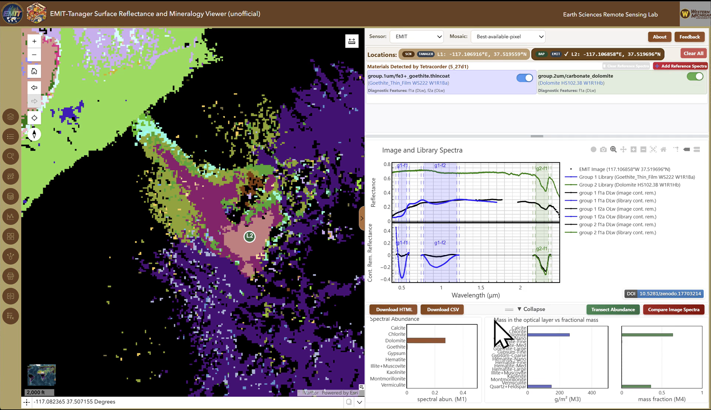

# SpectralViewer-Tanager

A public-facing hyperspectral viewer for evaluating how [Planet Tanager](https://www.planet.com/constellations/tanager/) imagery can be transformed into mineral identification and abundance products using open-source scientific workflows.

This project adapts [Tetracorder](https://github.com/PSI-edu/spectroscopy-tetracorder) and [EMIT-SDS-L2B](https://github.com/emit-sds/emit-sds-l2b) to publicly available [Tanager scenes](https://www.planet.com/data/stac/browser/tanager-core-imagery/catalog.json) from the [Energy and Mining catalog](https://www.planet.com/data/stac/browser/tanager-core-imagery/energy-mining/collection.json) to generate [EMITL2BMIN-001](https://www.earthdata.nasa.gov/data/catalog/lpcloud-emitl2bmin-001)-like mineral products for scientific interpretation and validation.

## Demo

Watch the demo video: [SpectralViewer-Tanager-Demo.mp4](./SpectralViewer-Tanager-Demo.mp4)

## Overview

[SpectralViewer-Tanager](https://www.esrs.wmich.edu/webmap/SpectralViewer-Tanager/) is an interactive web-GIS application for exploring how Planet Tanager hyperspectral data can be converted into science-ready mineral mapping products using established open-source workflows. It is adapted from [SpectralViewer](https://www.esrs.wmich.edu/webmap/SpectralViewer/), a related EMIT visualization system developed with support from the NASA EMIT Science and Applications Team (Award No. [80NSSC24K0863](https://earth.jpl.nasa.gov/emit/science/team-projects/maps-geology/)) at the [Earth Sciences Remote Sensing Facility](https://www.esrs.wmich.edu/) at [Western Michigan University](https://wmich.edu/).

The project applies these methods to Tanager scenes to produce mineral identification, band-depth, and abundance outputs for geologic and environmental applications while enabling direct comparison with EMIT data over the same area. It demonstrates how public hyperspectral data can be converted into interpretable mineral products and shared through a transparent web portal.

### Key Capabilities

- **Open-source science**: Builds on [Tetracorder](https://github.com/PSI-edu/spectroscopy-tetracorder) and [EMIT-SDS-L2B](https://github.com/emit-sds/emit-sds-l2b)
- **Mineral mapping**: Identifies and maps mineral composition from hyperspectral imagery using [Tetracorder](https://github.com/PSI-edu/spectroscopy-tetracorder)
- **Interactive portal**: Visualizes spectra, reference signatures, absorption features, abundance maps, and transects, with HTML/CSV downloads for offline analysis
- **Open workflow**: Applies a transparent processing chain to 17 public Planet Tanager scenes from the [Mining and Energy data catalog](https://www.planet.com/data/stac/browser/tanager-core-imagery/energy-mining/collection.json)
- **Cross-sensor validation**: Supports direct Tanager-vs-EMIT comparison over the same area

### Target Users

Researchers, geologists, exploration teams, environmental specialists, cross-sensor validation scientists, and remote sensing educators who need interpretable mineral information from hyperspectral imagery for real-world applications.

## Scientific Foundation & Methods

This project builds on three open-source scientific foundations:

- **[Tetracorder](https://github.com/PSI-edu/spectroscopy-tetracorder)**: A field-tested mineral identification framework for spectral matching and mineral detection
- **[EMIT-SDS-L2B](https://github.com/emit-sds/emit-sds-l2b)**: The EMIT processing pipeline that informs the mineral identification and abundance-style post-processing adapted here
- **[SpectralViewer](https://www.esrs.wmich.edu/webmap/SpectralViewer/)**: An interactive EMIT visualization interface used as a design reference for the Tanager deployment

The project adds adaptation layers for Tanager scene handling, data preparation, pipeline orchestration, and web-application configuration.

### Processing Workflow

The workflow applied to 17 Planet Tanager scenes from the [Planet Mining and Energy open data catalog](https://www.planet.com/data/stac/browser/tanager-core-imagery/energy-mining/collection.json) follows a modular sequence:

1. **Data preparation**: Ingest orthorectified HDF5 surface reflectance products and convert them to Tetracorder-compatible ENVI format with Tanager-specific wavelength, FWHM, and channel metadata.
2. **Tetracorder processing**: Run the open-source Tetracorder framework for spectral matching and mineral detection.
3. **L2B product generation**: Apply EMIT-SDS-L2B logic adapted for Tanager to produce mineral identification, band-depth, and abundance products.
4. **Service publication**: Publish reflectance and mineral products as public ESRI image services.
5. **Interactive delivery**: Provide direct Tanager-vs-EMIT comparison through the web portal.

This workflow is transparent, reproducible, and extensible to additional Tanager observations.

## Impact

Planet Tanager provides a valuable hyperspectral dataset for mineral exploration, geologic mapping, and environmental monitoring. The project demonstrates how these data can be processed with transparent, reproducible workflows and compared with established EMIT products to support cross-sensor validation and scientific interpretation.

## Getting Started

Visit the live application at: [SpectralViewer-Tanager Portal](https://www.esrs.wmich.edu/webmap/SpectralViewer-Tanager/)

For technical implementation details and workflow examples, refer to the open-source repositories cited above.

## License

This work adapts components from open-source projects. Please refer to the original repositories for license information.

## Citation

If you use this project in research, please cite:

- The Tetracorder Expert System
- The EMIT-SDS-L2B processing pipeline
- The Planet Tanager Open Data Catalog
- This repository and the EMIT Spectral Viewer application

## Contact & Contributions

For questions, please contact the developer: [Mustafa Emil](https://mkemalemil.github.io/). 
